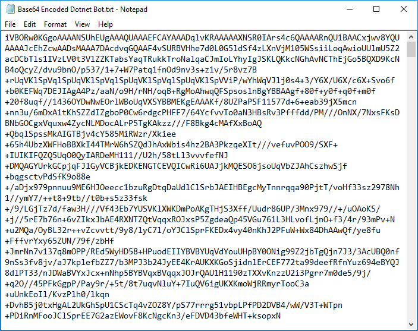
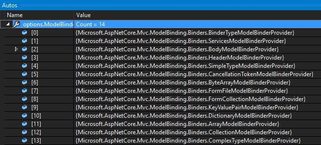

# Custom Model Binding

By [Steve Smith](http://ardalis.com)

Model binding allows controller actions to work directly with model types, passed in as method arguments, rather than HTTP requests. Repetitive mapping between incoming request data and application models is consolidated into model binders. Developers can extend the built-in model binding functionality by implementing custom model binders.

[View or download sample from GitHub](https://github.com/aspnet/Docs/tree/master/aspnetcore/mvc/advanced/custom-model-binding/)

## The problem

The default model binding supports most of the common data types in the framework. The built-in model binders should support most of developers' needs. However, the default model binders expect to bind text-based input from the request directly to model types. You might need to transform the input prior to binding it. For example, when you have a key that can be used to look up model data. You can use a custom model binder to fetch data based on the key and pass the result as the action's argument.

Model binding uses specific definitions for the types it operates on. A *simple type* is a type that should be converted from a single string in the input. A *complex type* is a type that should be converted from multiple input values. The framework determines the difference based on the existence of a `TypeConverter`. It's recommended to create a type converter if you have a simple `string` -> `SomeType` mapping that doesn't require external resources.

## The solution

Before creating your own custom model binder, it's worth reviewing how existing model binders are implemented. For example, the [ByteArrayModelBinder](https://docs.microsoft.com/aspnet/core/api/microsoft.aspnetcore.mvc.modelbinding.binders.bytearraymodelbinder) can be used to convert base64-encoded strings into byte arrays, for storage as files or database BLOB fields.

### Working with the ByteArrayModelBinder

Base64-encoded strings can be used to represent binary data. For example, the following image can be encoded as a string.

A small portion of the encoded string is shown in the following image:

Your ASP.NET Core MVC app can accept base64-encoded strings as inputs and use the `ByteArrayModelBinder` to convert these inputs into a byte array. The `ByteArrayModelBinder` is configured to work with `byte[]` arguments through the `ByteArrayModelBinderProvider`, which implements `IModelBinderProvider`. When creating your own custom model binder, you can implement your own `IModelBinderProvider` type, or use the `ModelBinderAttribute`.

The following example demonstrates how to accept and save a `byte[]` array that uses the `ByteArrayModelBinder`:

[!code-csharp[Main](custom-model-binding/sample/CustomModelBindingSample/Controllers/ImageController.cs?name=post1&highlight=3)]

You can POST a base64-encoded string to this api method using a tool like [Postman](https://www.getpostman.com/):

The model binder will work equally well with a viewmodel instead of individual action arguments:

[!code-csharp[Main](custom-model-binding/sample/CustomModelBindingSample/Controllers/ImageController.cs?name=post2&highlight=2)]

As long as the binder can bind request data to appropriately named properties or arguments, model binding will succeed.

## Implementing a custom model binder

You can implement your own custom model binder that:

- Converts incoming request data into properly-typed keys.
- Uses Entity Framework Core to fetch the associated entity.
- Passes the associated entity as an argument to the action method.

The simplest approach is to use the `ModelBinderAttribute`. With this attribute, you specify the name of the input that is bound and the type of the `IModelBinderProvider` that it should use. The `ModelBinderAttribute` is applied to the type that should use the model binder:

[!code-csharp[Main](custom-model-binding/sample/CustomModelBindingSample/Data/Author.cs?highlight=10)]

The `AuthorEntityBinder` takes in an instance of `AppDbContext`. After confirming the expected input (in this case, "id", as specified in the attribute above) is present, it casts it to an integer and uses it to retrieve the associated entity. If successful, the result is set on the binding context. If model binding fails, the argument passed to the action method is set to `null`.

[!code-csharp[Main](custom-model-binding/sample/CustomModelBindingSample/Binders/AuthorEntityBinder.cs?name=demo&highlight=2)]

> Note:
> The preceding example's default model name logic can be omitted if you always specify the `Name` on the `ModelBinderAttribute`.

The `AuthorEntityBinder` allows action methods to use the `Author` entity directly:

[!code-csharp[Main](custom-model-binding/sample/CustomModelBindingSample/Controllers/BoundAuthorsController.cs?name=demo1&highlight=2)]

Using this approach, both the controller and action method are simplified compared to performing the same work in the controller, since the `AppDbContext` is no longer required by the action or controller.

> Note:
> You can also apply the `ModelBinderAttribute` to individual model properties or to action method parameters to specify a certain model binder for just that type or action.

### Implementing a ModelBinderProvider

Instead of applying an attribute, you can implement [IModelBinderProvider](https://docs.microsoft.com/aspnet/core/api/microsoft.aspnetcore.mvc.modelbinding.imodelbinderprovider). This is how the built-in framework binders are implemented. Note that when you specify the type your binder operates on, you specify the type of argument it produces, not the input your binder accepts. The following binder provider would work for the `AuthorEntityBinder` implemented above, and when added to MVC's collection of providers, would eliminate the need for the `ModelBinderAttribute` on `Author`.

[!code-csharp[Main](custom-model-binding/sample/CustomModelBindingSample/Binders/AuthorEntityBinderProvider.cs?highlight=17-20)]

> Note:
> The example above returns a `BinderTypeModelBinder`, which acts as a factory for model binders and provides dependency injection for them. Use it if your model binder requires services from DI.

In order to configure MVC to use a custom model binder provider, you add it in `ConfigureServices`. When evaluating model binders, the collection of providers is examined in order. The first provider that returns a binder is used. Below you can see the default model binders, in order:

Adding your provider to the end of the collection may result in it never being called. In this example, the custom provider is added to the beginning of the collection to ensure it is used for `Author` action arguments.

[!code-csharp[Main](custom-model-binding/sample/CustomModelBindingSample/Startup.cs?name=callout&highlight=5-9)]

## Recommendations and best practices

Model binders should not attempt to set status codes or return results (for example, 404 Not Found). If model binding fails, an [action filter](/mvc/controllers/filters.md) or logic within the action method itself should handle the failure.

Typically, you don't need to write your own provider.

Custom model binders are most useful for eliminating repetitive code and cross-cutting concerns from action methods.

While model binders can be used to convert a string into a custom type, a [`TypeConverter`](https://msdn.microsoft.com/en-us/library/ayybcxe5.aspx) is usually a better option.