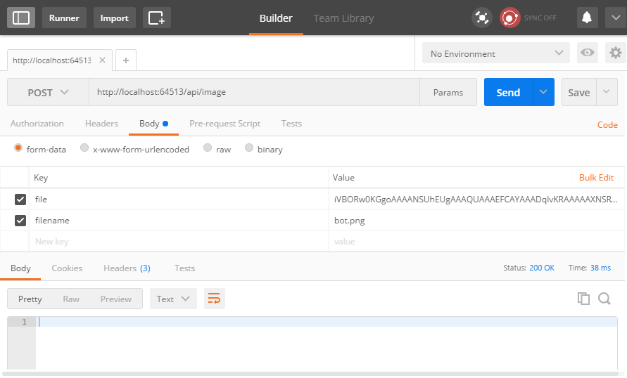

# Custom Model Binding

By [Steve Smith](http://ardalis.com)

Model binding allows controller actions to work directly with model types, passed in as method arguments, rather than HTTP requests. Repetitive mapping between incoming request data and application models is consolidated into model binders. Developers can extend the built-in model binding functionality by implementing custom model binders.

[View or download sample from GitHub](https://github.com/aspnet/Docs/)

## The problem

The default model binding supports simple types such as strings, integers, floats, DateTimes, and more. In addition, model binding works with classes that have properties comprised of these primitive types. However, the default model binders expect to bind text-based input from the request directly to model types. You might need to transform the input prior to binding it. One example of this is if you have input that represents a key that can be used to look up model data from a data store. You can use a custom model binder to fetch data based on the key and pass the result as the action's argument.

## The solution

Before creating your own custom model binder, it's worth reviewing how existing model binders are implemented. For example, the [ByteArrayModelBinder](https://docs.microsoft.com/aspnet/core/api/microsoft.aspnetcore.mvc.modelbinding.binders.bytearraymodelbinder) can be used to convert base64-encoded strings into byte arrays, for storage as files or database BLOB fields.

### Working with the ByteArrayModelBinder

Base64-encoded strings can be used to represent binary data. For example, the image shown below can be encoded as [this string](custom-model-binding/base64bot.md).


Your ASP.NET Core MVC app can accept base64-encoded strings as inputs and use the `ByteArrayModelBinder` to convert these inputs into a byte array. The `ByteArrayModelBinder` is configured to work with `byte[]` arguments through the `ByteArrayModelBinderProvider`, which implements `IModelBinderProvider`. When creating your own custom model binder, you can implement your own `IModelBinderProvider` type, or use the `ModelBinderAttribute`.

The following example demonstrates how to accept and save a `byte[]` array that uses the `ByteArrayModelBinder`:

[!code-csharp[Main](custom-model-binding/sample/CustomModelBindingSample/Controllers/ImageController.cs?name=post1&highlight=3)]

You can POST a base64-encoded string to to this api method using a tool like Postman:



The model binder will work equally well with a viewmodel instead of individual action arguments:

[!code-csharp[Main](custom-model-binding/sample/CustomModelBindingSample/Controllers/ImageController.cs?name=post2&highlight=2)]

## Implementing a custom model binder

You can implement your own custom model binder that converts incoming request data into keys and uses Entity Framework Core to fetch the associated entity and pass it as an argument to the action method. The simplest approach is to use the `ModelBinderAttribute`, which you apply to the type you'll be binding. With this attribute, you specify the name of the input that will be bound and the type of the `IModelBinderProvider` that it should use. The `ModelBinderAttribute` is applied to the type that should use the model binder:

[!code-csharp[Main](custom-model-binding/sample/CustomModelBindingSample/Data/Author.cs?highlight=10)]

The `AuthorEntityBinder` uses dependency injection to request an instance of `AppDbContext`. After confirming the expected input (in this case, "id", as specified in the attribute above) is present, it casts it to an integer and uses it to retrieve the associated entity. Finally, if successful, the result is set on the binding context. If model binding fails, the argument passed to the action method will be `null`.

[!code-csharp[Main](custom-model-binding/sample/CustomModelBindingSample/Binders/AuthorEntityBinder.cs?highlight=10)]

With this in place, action methods can use the `Author` entity directly:

[!code-csharp[Main](custom-model-binding/sample/CustomModelBindingSample/Controllers/BoundAuthorsController.cs?highlight=2)]

Using this approach, both the controller and action method are simplified compared to performing the same work in the controller:

[!code-csharp[Main](custom-model-binding/sample/CustomModelBindingSample/Controllers/AuthorsController.cs?highlight=2)]


## Recommendations and best practices

Model binders should not attempt to set status codes or return results (for example, 404 Not Found). Instead, if model binding fails, this should be the responsibility of an [action filter](/mvc/controllers/filters.md) or logic within the action method itself.


> [!NOTE]
> This is a note example.

Copy the `IFormFile` to a stream and save it to the byte array:

```csharp
// POST: /Account/Register
[HttpPost]
[AllowAnonymous]
[ValidateAntiForgeryToken]
public async Task<IActionResult> Register(RegisterViewModel model)
{
    ViewData["ReturnUrl"] = returnUrl;
    if  (ModelState.IsValid)
    {
        var user = new ApplicationUser {
          UserName = model.Email,
          Email = model.Email
        };
        using (var memoryStream = new MemoryStream())
        {
            await model.AvatarImage.CopyToAsync(memoryStream);
            user.AvatarImage = memoryStream.ToArray();
        }
    // additional logic omitted
    
    // Don't rely on or trust the model.AvatarImage.FileName property 
    // without validation.
}
```
